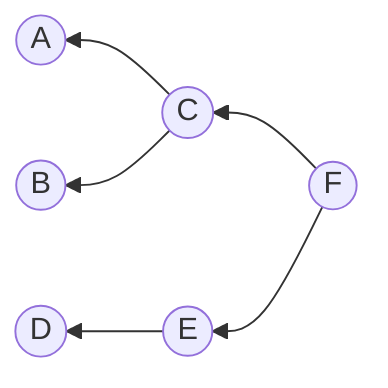
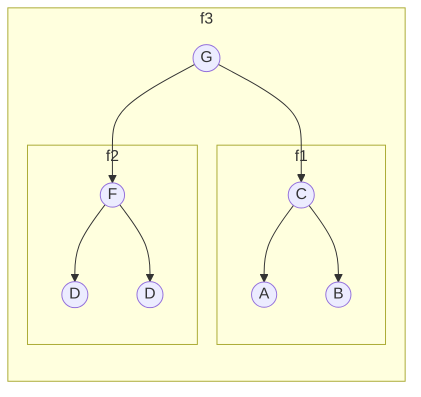
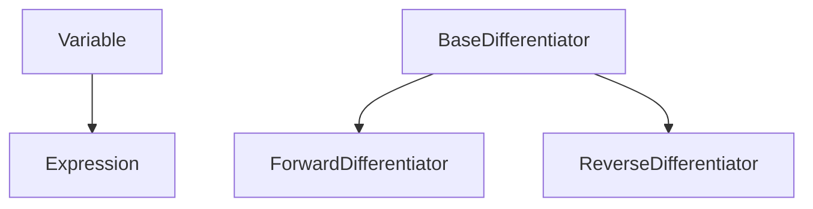
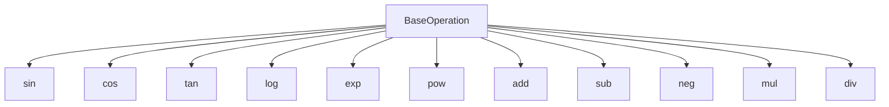

# CS-207 Final Project Milestone 1

## Introduction

Differentiation is great. It is a necessity in a vast range of applications, such as atomic simulations, economic analysis, and machine learning. In the field of computational science, when functions and programs get complicated, differentiation can become burdensome. This is why we need *automatic differentiation*! It finds the derivative of numerical expressions to the accuracy of machine precision.

`superdiff` performs automatic differentiation on single- or multi-variable functions using the _forward mode_ as well as the _reverse mode_. The function is stored as an `Expression` class that can output values and derivatives wherever you need it.

## Background
Differentiation is the process of finding derivative, which is the rate of change of a function's output with regard to its variables. Take $f(x,y) =3*x^2+\exp(y)$ as an example. Symbolic differentiation gives $\dfrac{\partial f}{\partial x}=6x$ and $\dfrac{\partial f}{\partial y}=\exp(y)$.

Automatic differentiation treats a function as a chain of elementary functions and performs differentiation on each elementry function. 
Here the elementary functions include: (1) A single arithmetic operation, such as $3*x$ and $x_1+x_2$. (2) A single trigonometric operation, such as $\sin(x)$. (3) A single exponential or logarithmic opration, such as $\log(x)$.

The chain rule dictates that 
$$\dfrac{df(g(x))}{dx}=\dfrac{df(x_1)}{dx_1}*\dfrac{dg(x)}{dx}.$$

Therefore, a function that is made up of elementary functions can be extended into a computational graph. For $f(x,y) =3*x^2+\exp(y)$, the graph is shown below. Each $x_i$ is the output of an elementary function.


  
To calulate the derivative of $f$ at $[x,\ y]$, we pass the value of the previous $x_i$ or $x_i^\prime$ into the next elementary function to evaluate the derivative of that elementary function. The full derivative is computed using the chain rule. To get $\dfrac{\partial f}{\partial x}$, forward mode starts from $\dfrac{\partial x_1}{\partial x}$, while the reverse mode starts from $\dfrac{\partial x_6}{\partial x_4}$. The result is 
$$\dfrac{\partial f}{\partial x} = \dfrac{\partial x_6}{\partial x_4}\dfrac{\partial x_4}{\partial x_3}\dfrac{\partial x_3}{\partial x_1}\dfrac{\partial x_1}{\partial x}=1*3*2x*1=6x$$


## How to Use `superdiff`

Our goal is for the syntax of `superdiff` to be as natural as possible, not requiring the user to learn any new paradigms and thereby minimizing the chances of hard-to-debug errors. Therefore, we take inspiration from the kind of notation one might use when writing out mathematical expressions and functions by hand. For instance, we might have the rather complicated function:

$$
    f(x, y) = \frac{x \cdot 0.2 + (\log(x))^3}{y}
$$

The core functionality of `superdiff` involves three main kinds of objects: `Variable`, `Expression`, and subclasses of `Operation`. These mean exactly what you might expect from a mathematical context. If a user wants to define an expression, they do so with one or more `Variable`s, and any arbitrary number of `Operation`s. To make a new `Expression` object, the user combines these `Variable` and `Operation` objects in the constructor of the `Expression`, simultaneously defining the ordering of the variables for later use.

**Note: the following is not the final syntax for `superdiff`, but rather a pseudo-code example that encapsulates the main design choices we hope to implement.**
```python 
import superdiff as sd

# Define the base variables
x = sd.Variable('x')
y = sd.Variable('y')

# Use the variables in an arbitrary expression
f = sd.make_expression((x * 0.2 + sd.log(x) ** 3) / y, vars = [x, y])
```

This creates an `Expression` that is mathematically equivalent to the one above. As well, the user can evaluate this `Expression` just as they might evaluate a function

```python
# Evaluate f at a value
f(0.55, -3)
```

Or differentiate it using the forward or reverse mode

```python
# Differentiate using forward mode (the default)
sd.diff(f, 0.55, -3)

# Differentiate using reverse mode
sd.diff(f, 0.55, -3, mode='reverse')
```

If the user prefers not to have to remember the order of the arguments, they can use named arguments for evaluating `f` or `sd.diff(f)`:

```python
sd.diff(f, y=-3, x=0.55)
```

## Software Organization
### A. What will the directory structure look like?
```
superdiff/
|
|-- superdiff/
|   |-- __init__.py
|   |-- differentiate.py
|   |-- expression.py
|   |-- math.py
|   |-- tests/
|       |-- __init__.py
|       |-- diff_test.py
|       |-- stress.py
|
|-- docs/
|   |-- userdoc.md
|   |-- implementation.md
|
|-- examples/
|   |-- example1.py
|   |-- example2.py
|
|-- README.md
|-- requirements.txt
|-- setup.py
|-- LICENSE
```

Throughout the duration of the project, the `docs/` subdirectory will host our milestone documents. Upon completion of the project, the `docs/` subdirectory will include `userdoc.md` for a straightforward guide to using `superdiff`. `implementation.md` will be a developer's guide to help developers and advanced users understand implementation and abstraction details. 

### B. What modules do you plan on including? What is their basic functionality?

Our two main modules will be `differentiate.py` and `math.py`. 

1. `differentiate.py` will contain the code for our BaseDifferentiator, ForwardDifferentiator, and  ReverseDifferentiator Classes, along with other Operation classes we choose to include. This program will be the interface through which users will use automatic differentiation.

2. `expression.py` will contain the code for our Variable, Expression, and BaseOperation classes. These objects will create the graph and trace table structures when users input a function. Users can then call the differentiator functions implemented in `differentiate.py` to differentiate their function. 

2. `math.py` will include mathematical constants and helper methods to implement the operations which users can use through the `superdiff` module, such as $\sin(x)$ or $\ln(y)$.

As well, directory `examples/` will provide some example code to show users how to perform different workflows in `superdiff`.

- Where will your test suite live? Will you use TravisCI? CodeCov?

Our test suite will live inside the `tests/` subdirectory under `superdiff/`. `diff_test.py` will include many unit tests to ensure the differentiator modules run correctly and handle edge cases appropriately for a variety of complex functions. They will also more closely test many of the operations abstracted away under the hood to ensure quality is maintained beneath all the layers. Additionally, we will also apply stress tests to see how our package handles overloading. `pytest` will be key in handling this test suite efficiently.

We will utilize TravisCI to perform integration testing as we build the package, which will help us flag defects as they arise and maintain quality control among the various components in our software. In addition, CodeCov will help us analyze ways to improve our test suite so that we maintain high coverage of our code.

### C. How will you distribute your package (e.g. PyPI)?

We will use PyPI to distribute our package and use `pip` to package the software. In `setup.py`, we will include a brief description of the package, authors and licensing information, and the appropriate version of the package so that we can host our package on PyPI. This will allow potential users to easily install our product through the `pip` command.

### D. How will you package your software? Will you use a framework? If so, which one and why? If not, why not?

As mentioned in section C, we will use `pip` to package the software, with dependencies included in `requirements.txt` This is because it is a straightforward and standard method of packaging software and we don't need to rely on a separate framework. Also Michael said it was a good idea.

### E. Other considerations?  

After ensuring the success of our unit tests, we will more broadly apply exploratory testing to find and correct any new corner cases we have not encountered previously.

## Implementation
### A. Core Data Structures

The function to be differentiated (henceforth referred to as ƒ) will be parsed and converted into a directed graph, containing node-like objects for each row in the traceplot (i.e. for each elementary operation in ƒ). The edges of the graph will represent steps from one part of the traceplot to the next.

Each node will contain
- Type of elementary operation being performed
- References to the two mathematical objects that are going to be transformed in the operation
- Importantly, *a node does not reference its children*. That is, say we have the following situation:


In this case, C knows about A and B, but not about F. This may seem counterintuitive, since in the forward mode of autodiff, we need to go from A to C to F. However, we want to allow for situations like the following:

Here, the function `f3` is composed of two inputs (`f1` and `f2`) and combines them in an operation in node G. Rather than copying functions `f1` and `f2` into brand new graphs, we believe that it would be more memory- and time-efficient to simply refer to the same graph objects that `f1` and `f2` refer to. However, this creates a potential issue if we were to implement the graphs as bidirectional, rather than unidirectional: if we add a connection from G to C *and* C to G, then if the user tries to run the forward mode of autodiff on `f1`, the algorithm will continue past node C onto node G. However, node G is not part of function `f1`!

This design choice has a tradeoff, namely that each time autodifferentiation is performed, Python must step from the end of the function all the way to the beginning leaf nodes. In development, we will run tests to determine if this significantly impacts performance. If it does, then we will consider strategies to alleviate the issue. One potential solution would be to make the graph bidirectional, but to also store a reference to the root node. Then, when the algorithm reaches the root node, it knows to stop.

### B. Classes

`Variable` class

- Placeholder for the variable in the eventual function
- Can be combined with other variables or scalars using elementary operations to create more complex expressions
- Has a simple implementation of `.currval()` and `.deriv()` that just return the current value and 1, respectively
- Is also used to start the evaluation trace
- Is also used to search for the location of the parameters in the evaluation trace

`Expression` class

- Subclass of `Variable`
- Has the attribute `_varlist` to store the order of variables
- Represents a function to be differentiated
- Contains references to other `Expression`s or `Variable`s
- Performs differentiation and evaluation at specific points by calling `BaseOperation`

`BaseOperation` and its subclasses

- Arithmetic operations and functions such as $\sin$ and $\log$

`BaseDifferentiator`

- Implements basic functionality for both differentiator classes.

`ForwardDifferentiator`
    
- Does the traceplot for forward mode
    
`ReverseDifferentiator`

- Does the traceplot for reverse mode


**Inheritance diagram**



### C. Methods and Name Attributes

`Variable`
- `curr_val()`
- `__repr__()`
- `__str__()`
- `__eq__()`

`Expression`
- All methods defined in `Variable`
- Stores a list of parent nodes (typically one or two parent nodes)
- An `Expression` knows which parameters go with each parent node
    - E.g. say an `Expression`, `expr1`, has two parent nodes `par1` and `par2`. `expr1` is a function of three parameters: $x$, $y$, $z$. Then, when `expr1` is initialized, in the constructor, Python will "ask" each of `par1` and `par2` whether their leaf nodes (i.e. the `Variable` objects at the end of their computational graphs) contain the `Variable` objects that correspond to $x$, $y$, or $z$. Then, `expr1` will store which variables correspond to which Parent expressions.
- `_varlist` is a list containing the arguments to the `Expression` in the order specified by the user
- The constructor is used to create an individual node from at most two `Expression`s and an `Operation`:
```python
e = Expression(expr1, expr2, sd.mul)
```
The user will rarely call this constructor themselves. Rather, they will call a wrapper around the `Expression` constructor that allows them to specify the order of the function arguments:
```python
e = sd.make_expression(x * 0.2 + y, vars=[x,y])
```
where `x` and `y` are `Variable` or `Expression` objects. The second argument, `varlist=[x,y]` sets the `_varlist` attribute of the `Expression` object, which remembers the correct order of the arguments.
- `next_parent()` to get the next parent node of the `Expression`
- Arithmetic oprations that call `BaseOperation`
- `__str__()` and `__repr__()`

`BaseOperation` and other `Operation` subclasses
- Used to implement elementary operations at each step in the computational graph
- `eval()` and `deriv()` methods
- `__str__()` and `__repr__()`
- We are using inheritance here rather than simply defining these operations ourselves so that all operations have a unified interface


`BaseDifferentiator`
- Unimplemented version of `deriv()`

- Has `.diff()` method
- Also a nice `__str__` method
- Ensures a consistent interface across different differentiator subclasses
- Function signature: `BaseDifferentiator`

`ForwardDifferentiator`
- Same `.diff()` method as `BaseDifferentiator` but implementing forward mode under the hood

`ReverseDifferentiator`
- Same `.diff()` method as `BaseDifferentiator` but implementing reverse mode under the hood

### D. External Dependencies

* `numpy`
* `pytest` (only for the test suite, not for the actual functionality)

### E. Dealing with Elementary Functions (sin, log, etc.)

- We will create a suite of elementary operations that know what their derivatives are (described above)
- Each node in the computational graph will be associated with one of these elementary operation objects, as well as the argument(s) for that operation (in the form of references to parent nodes)
- When it comes time to differentiate an expression, the differentiator will find which operation is associated with that given step in the evaluation trace, and simply call `operation_name.deriv(*args)`
- As well, when the user defines ƒ, they will have to use either the built-in Python operations (add, subtract, multiply, divide, power) or our custom functions, which will have the exact same interface as analogous `numpy` or `math` functions. E.g.
```python
import superdiff as sd

x = sd.Variable('x')
y = sd.Variable('y')
f = sd.Expression((x * 0.2 + sd.log(x) ** 3) / y, vars = [x, y])
```
When the built-in Python methods are called (`*`, `+`, `**`, `/`), the appropriate methods of the `Variable` or `Expression` objects will be called, which will in turn call the correct `BaseOperation` subclass. E.g. under the hood, the `Variable.__add__()` method actually calls our `add` operation (subclass of `BaseOperation`), which will then return an `Expression` object (ƒ). The new `Expression`'s root node will refer back to the `add` object so that when ƒ is differentiated, it simply calls the `add.curr_val(parent1, parent2)` or `add.deriv(parent1, parent2)` methods when needed.

Under the hood we convert ${x_1}^{x_2} = \exp(x_2*\log(x_1))$ and $\log_{x_1}{x_2}=\dfrac{\log(x_2)}{\log(x_1)}$.